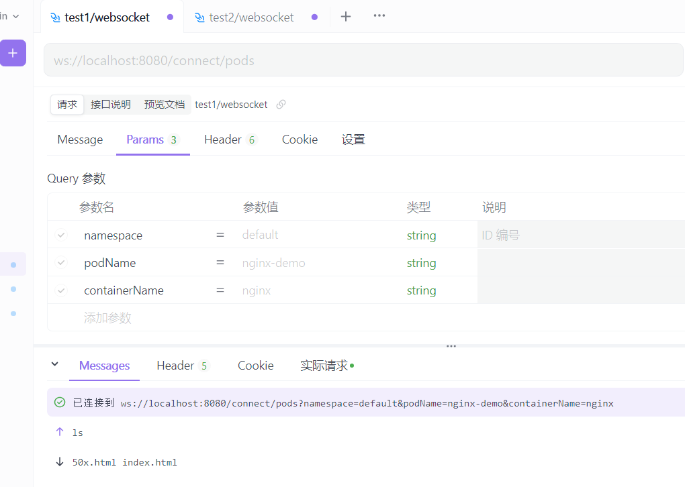

#  webshell-demo
该demo基于springboot, websocket, 实时接受前端命令并通过kubernetes官方java客户端client-java提供的api连接kubernetes集群，操作pod。该demo仅提供连接kubernetes的方法、测试listPods接口、向pod内发送command命令及与前端的websocket实时交互。

---
This demo is based on Spring Boot, WebSocket, and it accepts commands from the front end in real time and connects to the Kubernetes cluster through the API provided by the official Kubernetes Java client, client-java, to operate on pods. This demo only provides methods for connecting to Kubernetes, testing the listPods interface, sending command commands to pods, and real-time interaction with the front end via WebSocket.

----
### api工具测试样例

### 控制台样例

---

### 注意：
##### 1.修改KubernetesConfig.java文件中kubeConfigPath路径改为你自己的./kube/config文件
##### 2.websocket请求需携带三个参数：namespace,podName,containerName

---
###### email: oh03020113@163.com
